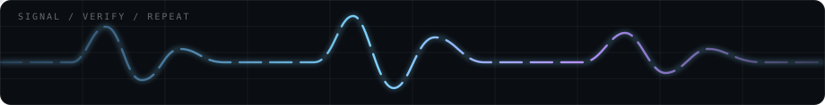

<p align="center">
  
</p>

<p align="center">
  <code>mathematics</code> ·
  <code>systems</code> ·
  <code>scientific software</code> ·
  <code>independent projects</code>
</p>

<p align="center">
  <a href="https://github.com/vitae0?tab=repositories">repositories</a>
  ·
  <a href="https://novuscollective.org">novus collective</a>
</p>

---

### I build things that make difficult questions easier to attack.

Most of my work sits somewhere between **mathematics, low-level systems, scientific tooling, human-computer interaction and simulation**.

I like software that exposes what it is doing instead of hiding behind a polished button.  
Numerical evidence is evidence, **not proof**. Missing data should be reported as missing. A tool should be able to say *I don't know*.

```text
current loop:

question → model → compute → break assumption → rebuild → verify
                                      ↑             |
                                      └─────────────┘
```

<p align="center">
  
</p>

## Selected work

<table>
<tr>
<td width="50%" valign="top">

### ζ(5) research
A computational number theory project investigating an Apéry-style route to the irrationality of `ζ(5)`.

Current work revolves around exact rational forms, Brown–Zudilin constructions, p-adic denominator obstructions, asymptotics and falsifying attractive-but-wrong denominator models.

**Status:** WIP · active research · private working archive

</td>
<td width="50%" valign="top">

### Noetica
A local-first mathematical research laboratory for experimental mathematics, symbolic work, sequence discovery, counterexample search and proof preparation.

The rule is simple: **AI can propose; deterministic tools verify.**

**Status:** WIP · active · local research infrastructure

</td>
</tr>

<tr>
<td width="50%" valign="top">

### Netra
A Debian-first network visibility and authorized security-assessment workbench.

It unifies mature Linux tools under one scope policy, one workspace and one report layer instead of pretending to replace them.

**Status:** WIP · active · private

</td>
<td width="50%" valign="top">

### Wayfarer
A compact Debian-based persistent live USB environment.

Portable desktop, recovery environment and diagnostics kit, with every package forced to justify its place.

**Status:** WIP · active · private

</td>
</tr>

<tr>
<td width="50%" valign="top">

### Asia
An experimental compiled language for mathematical and computational research.

It is designed around semantic mathematical objects, exactness metadata and native compilation rather than treating mathematics as decorated generic code.

**Status:** WIP · private

</td>
<td width="50%" valign="top">

### AthanorLab
A programmable scientific simulation workbench built around composable physics modules and a central simulation engine.

The goal is a real virtual laboratory for mechanics, electromagnetism, fluids and reproducible numerical experiments, not a folder of disconnected demos.

**Status:** WIP · private

</td>
</tr>

<tr>
<td width="50%" valign="top">

### [linfo](https://github.com/vitae0/linfo) / [winfo](https://github.com/vitae0/winfo)
Small terminal-first system information shells for Linux and Windows.

Short commands, minimal dependencies, honest fallbacks and no scavenger hunt through ten different utilities.

</td>
<td width="50%" valign="top">

### [Novus Collective](https://novuscollective.org)
An independent student collective built around collaboration, ambitious projects and giving people room to make things that would otherwise never leave a notebook.

I work on the platform, infrastructure and projects around it.

</td>
</tr>
</table>

<details>
<summary><b>More things currently escaping containment</b></summary>
<br>

- **IPA Studio** *(WIP)* — native speech-analysis workbench for acoustics, IPA reference estimation and accent-model research.
- **GazeType** — camera-based eye-tracking and accessibility experiments.
- **Games & simulations** — browser-native experiments where the core mechanic or scientific model matters more than menu chrome.
- **Research portals** — local C/Python tooling for turning one-off mathematical computations into reproducible datasets and benchmarks.
- **System utilities** — small Linux/Windows tools for information, recovery and diagnostics.
- **Simulation architecture** — experiments with strategy, logistics, command latency and political systems.

</details>

## How I tend to build

```text
01  make the model explicit
02  keep the raw evidence
03  measure the expensive part
04  distrust pretty numerical patterns
05  automate repetition, not judgment
06  prefer local-first when the cloud adds nothing
07  make failure states visible
08  ship, then make the abstraction earn its existence
```

## Working stack

<p>
  
  
  
  
  
  
  
  
</p>

<details>
<summary><b>What I am interested in right now</b></summary>
<br>

`analytic number theory` · `p-adic structure` · `experimental mathematics` · `local AI` · `scientific interfaces` · `Linux` · `recovery systems` · `simulation` · `accessibility`

</details>

---

<p align="center">
  <sub>Build the instrument. Test the assumption. Keep the counterexample.</sub>
</p>
