<p align="center">
  
</p>

<p align="center">
  <code>mathematics</code> ·
  <code>systems</code> ·
  <code>scientific software</code> ·
  <code>independent projects</code>
</p>

<p align="center">
  <a href="https://github.com/vitae0?tab=repositories">repositories</a>
  ·
  <a href="https://novuscollective.org">novus collective</a>
  ·
  <a href="https://novus.study">novus.study</a>
</p>

---

## hello.

hey, i'm `vitae0`.

i'm usually somewhere between a math rabbit hole, a Linux terminal, a half-built tool, and a project that got **way bigger than it was supposed to**.

I like figuring out how things work and then making something out of that. Sometimes that means number theory or scientific software; sometimes it turns into an accessibility tool, a simulator, a tiny operating environment, or a completely unnecessary side project that I now care about far too much.

I don't really try to stay in one lane. If an idea is interesting enough, I'll probably poke at it until it becomes a repo.

### quote of the day

<!-- QUOTE_START -->
> *“Do not confuse polish with depth.”*
<!-- QUOTE_END -->

## Selected work

<table>
<tr>
<td width="50%" valign="top">

### ζ(5) research
A computational number theory project investigating an Apéry-style route to the irrationality of `ζ(5)`.

The work combines exact rational constructions, Brown–Zudilin periods, p-adic denominator analysis, asymptotics, large finite searches and deliberate attempts to break every promising conjecture before trusting it.

**Status:** WIP · active research · private working archive

</td>
<td width="50%" valign="top">

### Noetica
A local-first mathematical research laboratory for experimental mathematics, counterexample search, symbolic work and proof preparation.

The long-term goal is an AI-assisted research environment where model-driven exploration is separated from deterministic verification.

**Status:** WIP · private

</td>
</tr>

<tr>
<td width="50%" valign="top">

### [Novus Collective](https://novuscollective.org)
An independent student collective built around collaboration, ambitious projects and giving young people room to create work that would otherwise never leave a notebook.

**Founder.** I work on its direction, infrastructure, platform and projects.

</td>
<td width="50%" valign="top">

### [novus.study](https://novus.study)
A learning and project workspace being built around reusable tools, personal workspaces and a more exploratory way of studying technical subjects.

It is part of the broader Novus ecosystem rather than just a landing page.

**Status:** WIP · private codebase

</td>
</tr>

<tr>
<td width="50%" valign="top">

### Asia
An experimental compiled language for mathematical and computational research.

Its design treats sums, limits, algebraic structures and other mathematical objects as semantic objects with exactness and complexity metadata, rather than reducing everything immediately to generic arrays and functions.

**Status:** WIP · private

</td>
<td width="50%" valign="top">

### Square Packing 17
A computational-geometry research project searching for dense packings of 17 equal squares.

It combines simulated annealing, differential evolution, CMA-ES-style search, basin hopping, contact analysis and exact/algebraic reconstruction to turn numerical candidates into mathematical structure.

**Status:** WIP · private research code

</td>
</tr>

<tr>
<td width="50%" valign="top">

### [GazeType](https://github.com/vitae0/gazetype)
A camera-based accessibility system for typing with eye movement on ordinary hardware.

It combines gaze estimation, personal calibration, signal processing and conservative model reporting, with the broader goal of practical hands-free computer interaction without specialized eye-tracking equipment.

</td>
<td width="50%" valign="top">

### CanSat
An embedded flight-system project combining onboard sensors, GPS, camera hardware, telemetry and a ground-station receiver/dashboard.

It is one of the projects where software has to survive contact with actual hardware, radio links and noisy measurements, which is a refreshingly effective cure for elegant assumptions.

**Status:** WIP · private

</td>
</tr>
</table>

<details>
<summary><b>More projects / experiments</b> — smaller builds, prototypes and side quests</summary>
<br>

Not everything needs to become a five-year research program. These are smaller tools, experiments, prototypes and projects I built because the problem was interesting enough to deserve code.

#### Systems & developer tools

- **Netra** *(WIP · private)* — Debian-first network visibility and authorized security-assessment workbench built around Nmap, TShark, Zeek, Suricata and related tools.
- **Wayfarer** *(WIP · private)* — compact persistent Debian live USB for recovery, diagnostics and portable computing.
- **Code Atlas** *(WIP · private)* — local-first Tauri/Rust visual code reader for exploring files, symbols and dependency relationships.
- **[linfo](https://github.com/vitae0/linfo)** / **[winfo](https://github.com/vitae0/winfo)** — terminal-first Linux and Windows system-information shells.
- **[QueueGPT](https://github.com/vitae0/queuegpt)** — browser extension that queues prompts while ChatGPT is still generating.
- **LoviHub** *(WIP · private)* — local video-library desktop application.
- **Focus Forge** *(WIP · private)* — local-first task board and focus timer.

#### Science, math & modelling

- **AthanorLab** *(WIP · private)* — programmable scientific simulation workbench with composable physics modules.
- **IPA Studio** *(WIP · private)* — speech acoustics, IPA-reference estimation and accent-model research.
- **[Circuitry](https://github.com/vitae0/circuitry)** — grid-native browser circuit simulator.
- **Football Prediction System** *(WIP · private)* — leakage-safe football prediction and Monte Carlo tournament simulation.
- **Research portals** — local C/Python tooling for turning one-off computations into reproducible datasets and benchmark runs.

#### Apps & product experiments

- **Pace** *(WIP · private)* — local-first academic planner with structured topic/task data and AI-plan import.
- **Audra** *(WIP · private)* — mobile-first music discovery experiment with behavior-driven recommendation architecture.
- **İyilik Pasaportu** *(WIP · private)* — experimental social-impact project.
- **inat-site** *(WIP · private)* — web experiment / prototype.

#### Games & simulations

- **[Games & simulations](https://github.com/vitae0/games)** — collection of browser-native games and interactive scientific simulations.
- **[KSpiel](https://github.com/vitae0/kspiel)** — command, logistics and political simulation.
- **[Dungeon Ascendant](https://github.com/vitae0/funtest)** — dependency-free browser raycasting roguelike FPS.
- **[Backrooms](https://github.com/vitae0/backrooms)** — browser game / environment experiment.
- **[Dungeon](https://github.com/vitae0/dungeon)** — another small browser-game experiment.

</details>

## How I tend to build

```text
01  make the model explicit
02  keep the raw evidence
03  measure the expensive part
04  distrust pretty numerical patterns
05  automate repetition, not judgment
06  prefer local-first when the cloud adds nothing
07  make failure states visible
08  ship, then make the abstraction earn its existence
```

## Tech stack

<table>
<tr>
<td width="50%" valign="top">

<sub>CORE / SYSTEMS</sub>

<p>
  <a href="https://www.c-language.org/" title="C"></a>
  <a href="https://isocpp.org/" title="C++"></a>
  <a href="https://www.python.org/" title="Python"></a>
  <a href="https://www.rust-lang.org/" title="Rust"></a>
  <a href="https://www.gnu.org/software/bash/" title="Bash"></a>
  <a href="https://www.linux.org/" title="Linux"></a>
  <a href="https://www.debian.org/" title="Debian"></a>
</p>

</td>
<td width="50%" valign="top">

<sub>WEB / PRODUCT</sub>

<p>
  <a href="https://developer.mozilla.org/docs/Web/JavaScript" title="JavaScript"></a>
  <a href="https://www.typescriptlang.org/" title="TypeScript"></a>
  <a href="https://react.dev/" title="React"></a>
  <a href="https://nextjs.org/" title="Next.js"></a>
  <a href="https://nodejs.org/" title="Node.js"></a>
  <a href="https://vite.dev/" title="Vite"></a>
  <a href="https://developer.mozilla.org/docs/Web/HTML" title="HTML"></a>
  <a href="https://developer.mozilla.org/docs/Web/CSS" title="CSS"></a>
</p>

</td>
</tr>

<tr>
<td width="50%" valign="top">

<sub>DATA / INFRA</sub>

<p>
  <a href="https://www.sqlite.org/" title="SQLite"></a>
  <a href="https://supabase.com/" title="Supabase"></a>
  <a href="https://git-scm.com/" title="Git"></a>
  <a href="https://github.com/" title="GitHub"></a>
  <a href="https://cmake.org/" title="CMake"></a>
</p>

</td>
<td width="50%" valign="top">

<sub>COMPUTE / ML</sub>

<p>
  <a href="https://numpy.org/" title="NumPy"></a>
  <a href="https://pytorch.org/" title="PyTorch"></a>
  <a href="https://onnx.ai/" title="ONNX"></a>
  <a href="https://opencv.org/" title="OpenCV"></a>
</p>

</td>
</tr>
</table>

<sub>I use whatever makes the experiment easier to inspect and reproduce. Logos are tools, not personality traits.</sub>

## GitHub stats

<p align="center">
  
  
</p>

<p align="center">
  
</p>

<details>
<summary><b>What I am interested in right now</b></summary>
<br>

`analytic number theory` · `p-adic structure` · `experimental mathematics` · `local AI` · `scientific interfaces` · `Linux` · `recovery systems` · `simulation` · `accessibility`

</details>

---

<p align="center">
  <sub>Build the instrument. Test the assumption. Keep the counterexample.</sub>
</p>
