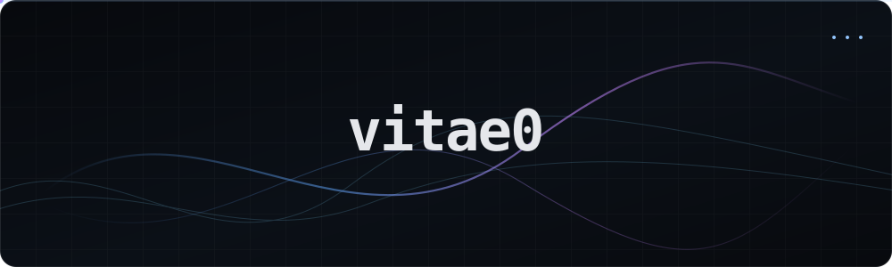

<p align="center">
  
</p>

<p align="center">
  <a href="https://github.com/vitae0?tab=repositories">repositories</a>
  ·
  <a href="https://novuscollective.org">novus collective</a>
</p>

---

## hello.

hey, i'm `vitae0`.

i work on math, physics, systems, and whatever problem currently refuses to behave.

most of what is here starts as an experiment. some of it becomes software; a few things turn into research. numerical evidence is evidence, not proof.

<!-- QUOTE_START -->
<p align="center"><i>“The greater the difficulty, the more glory in surmounting it.”</i><br>
<sub>— Epictetus</sub></p>
<!-- QUOTE_END -->

## Selected work

<table>
<tr>
<td width="50%" valign="top">

### ζ(5) research

Apéry-style work on the irrationality of `ζ(5)`: exact rational constructions, asymptotics, p-adic denominator bounds, chamber decompositions, and a fairly unreasonable amount of counterexample hunting.

**WIP · active research · working archive**

</td>
<td width="50%" valign="top">

### Noetica

Tools for experimental mathematics: exact searches, symbolic work, counterexample generation, reproducible computations, and proof bookkeeping.

Models may suggest things. Deterministic code gets the final word.

**WIP · private**

</td>
</tr>

<tr>
<td width="50%" valign="top">

### [Novus Collective](https://novuscollective.org)

An independent student collective for people who want to make things together instead of waiting for permission to start.

I founded it and work on its direction, infrastructure, publications, and projects.

</td>
<td width="50%" valign="top">

### [novus.study](https://novus.study)

A workspace for learning technical subjects and building projects around them: reusable tools, personal workspaces, and less rigid paths through material.

**WIP · private codebase**

</td>
</tr>

<tr>
<td width="50%" valign="top">

### Asia

An experimental compiled language for mathematical and computational work.

The interesting part is treating mathematical objects as mathematical objects for as long as possible, instead of immediately flattening everything into ordinary arrays and functions.

**WIP · private**

</td>
<td width="50%" valign="top">

### [linfo](https://github.com/vitae0/linfo) / [winfo](https://github.com/vitae0/winfo)

Small terminal-first system information tools for Linux and Windows.

Hardware, OS state, and useful diagnostics without turning `system info` into a dashboard product.

</td>
</tr>

<tr>
<td width="50%" valign="top">

### [GazeType](https://github.com/vitae0/gazetype)

Camera-based hands-free typing on ordinary hardware.

Gaze estimation, per-user calibration, signal processing, and careful reporting when the model is uncertain.

</td>
<td width="50%" valign="top">

### Wayfarer

A persistent Debian live system I can carry around, boot on unfamiliar machines, inspect broken systems with, and still use as an actual Linux environment.

**WIP · private**

</td>
</tr>
</table>

<details>
<summary><b>More projects / experiments</b></summary>
<br>

#### Systems & tools

- **Code Atlas** *(WIP · private)* — Tauri/Rust code reader for navigating files, symbols, and dependencies.
- **[QueueGPT](https://github.com/vitae0/queuegpt)** — queues prompts while ChatGPT is still generating.
- **LoviHub** *(WIP · private)* — local video-library desktop app.
- **Focus Forge** *(WIP · private)* — local-first task board and focus timer.

#### Science & math

- **AthanorLab** *(WIP · private)* — programmable scientific simulation workbench.
- **IPA Studio** *(WIP · private)* — speech acoustics, IPA estimation, and accent-model experiments.
- **[Circuitry](https://github.com/vitae0/circuitry)** — browser circuit simulator.
- **Football Prediction System** *(WIP · private)* — leakage-safe prediction and Monte Carlo tournament simulation.
- **Research portals** — C/Python tooling for turning one-off calculations into reproducible datasets and runs.

#### Apps

- **Pace** *(WIP · private)* — academic planner built around structured topic and task data.
- **Audra** *(WIP · private)* — music-discovery experiment.
- **İyilik Pasaportu** *(WIP · private)* — social-impact project.
- **inat-site** *(WIP · private)* — web experiment.

#### Games & simulations

- **[Games & simulations](https://github.com/vitae0/games)** — browser games and interactive scientific simulations.
- **[KSpiel](https://github.com/vitae0/kspiel)** — strategy simulation about command, logistics, and politics.
- **[Dungeon Ascendant](https://github.com/vitae0/funtest)** — dependency-free browser raycasting roguelike FPS.
- **[Backrooms](https://github.com/vitae0/backrooms)** — browser environment/game experiment.
- **[Dungeon](https://github.com/vitae0/dungeon)** — small browser-game experiment.

</details>

## Working rules

```text
numerical evidence != proof
keep the raw data
make the expensive part measurable
try to break the conjecture before polishing it
automate repetition, not judgment
prefer local-first when the cloud adds nothing
```

## Tech

<table>
<tr>
<td width="50%" valign="top">

<sub>CORE / SYSTEMS</sub>

<p>
  <a href="https://www.c-language.org/" title="C"></a>
  <a href="https://isocpp.org/" title="C++"></a>
  <a href="https://www.python.org/" title="Python"></a>
  <a href="https://www.rust-lang.org/" title="Rust"></a>
  <a href="https://www.gnu.org/software/bash/" title="Bash"></a>
  <a href="https://www.linux.org/" title="Linux"></a>
  <a href="https://www.debian.org/" title="Debian"></a>
</p>

</td>
<td width="50%" valign="top">

<sub>WEB</sub>

<p>
  <a href="https://developer.mozilla.org/docs/Web/JavaScript" title="JavaScript"></a>
  <a href="https://www.typescriptlang.org/" title="TypeScript"></a>
  <a href="https://react.dev/" title="React"></a>
  <a href="https://nextjs.org/" title="Next.js"></a>
  <a href="https://nodejs.org/" title="Node.js"></a>
  <a href="https://vite.dev/" title="Vite"></a>
  <a href="https://developer.mozilla.org/docs/Web/HTML" title="HTML"></a>
  <a href="https://developer.mozilla.org/docs/Web/CSS" title="CSS"></a>
</p>

</td>
</tr>

<tr>
<td width="50%" valign="top">

<sub>DATA / INFRA</sub>

<p>
  <a href="https://www.sqlite.org/" title="SQLite"></a>
  <a href="https://supabase.com/" title="Supabase"></a>
  <a href="https://git-scm.com/" title="Git"></a>
  <a href="https://github.com/" title="GitHub"></a>
  <a href="https://cmake.org/" title="CMake"></a>
</p>

</td>
<td width="50%" valign="top">

<sub>COMPUTE / ML</sub>

<p>
  <a href="https://numpy.org/" title="NumPy"></a>
  <a href="https://pytorch.org/" title="PyTorch"></a>
  <a href="https://onnx.ai/" title="ONNX"></a>
  <a href="https://opencv.org/" title="OpenCV"></a>
</p>

</td>
</tr>
</table>

<details>
<summary><b>current interests</b></summary>
<br>

`analytic number theory` · `p-adic structure` · `experimental mathematics` · `local AI` · `scientific interfaces` · `Linux` · `simulation` · `accessibility`

</details>
